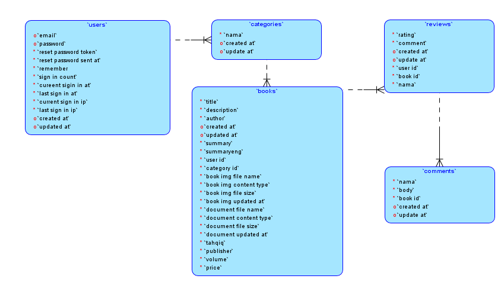
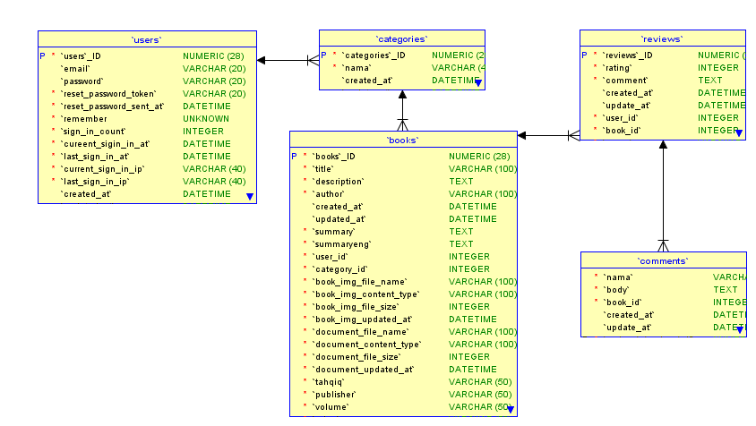

# 
 WEB APPLICATION DEVELOPMENT PROJECT

<h1 align="center">مكتبتي | مجموعة من أوراق العلماء</h1>
<h1 align="center">Maktabaty Book Review And Sharing</h1>

# OUTLINE

## Application Description
  
<i>”Maktabaty Book Review And Sharing”</i> merupakan sebuah aplikasi berbasis web yang dibuat dengan tujuan untuk mempermudah Pelajar , Mahasiswa, Santri, ataupun Masyarakat umum untuk mendapatkan informasi, e-book , dan forum diskusi tentang ‘Kutubut Turats’  atau yang dikenal baik oleh masyarakat luas yaitu <b>kitab kuning</b>, yang merujuk kepada kitab-kitab tradisional yang berisi pelajaran-pelajaran agama islam (diraasah al-islamiyyah) yang diajarkan pada Pondok-pondok pesantren, mulai dari Fiqh, Ilmu Tafsir, Ushulul Fiqh,  Tata Bahasa Arab (ilmu nahwu dan ilmu sharf), dan ilmu-ilmu keislaman lainnya, hingga pada ilmu sosial dan kemasyarakatan (muamalah). Dikenal juga dengan <b>kitab gundul</b> karena memang tidak memiliki harakat (fathah, kasrah, dhammah, sukun), tidak seperti kitab Al-Qur'an. Oleh sebab itu, untuk bisa membaca kitab kuning berikut arti harfiah kalimat per kalimat agar bisa dipahami secara menyeluruh, dibutuhkan waktu belajar yang relatif lama.

## User

User ini merupakan user yang memiliki akses untuk registrasi, login, logout, memberikan informasi kitab, melihat informasi kitab, memberikan review, melihat review, membagikan e-Book,  mengunduh e-Book, dan user dapat berbagi pendapat di dalam forum diskusi <i>(Bahtsul Masaail)</i>.

#  Platform

## Programming Language

* Ruby

* HTML (Hyper Text Markup Language)

* CSS (Cascading Style Sheet)

## Framework

* Front-End Framework 
    <tt>Bootstrap-Sass</tt>
    
* Back-End Framework 
    <tt>Ruby on Rails (ROR)</tt>

## Features

* User Registration 

* Login and logout User. 

* See and give more informations about books.

* See and give more reviews about books.

* See, give, and download e-Books.

* Add and see a theads.

* Add and see a comments of thread.

## Installing

* Clone this repo

* Install or Update your bundle

* migrate db

* seed db , if error change enctypted_password to password and change password to plain text

* add category in console ' c = Category.new( nama: "Ushul Fiqh" ) ' then ' c.save! '

## Modeling

## Database Scheme

<tt>create_table "books", force: :cascade do |t|</tt> 
    <tt>t.string "title"</tt> 
    <tt>t.text "description"</tt> 
    <tt>t.string "author"</tt> 
    <tt>t.datetime "created_at", null: false</tt> 
    <tt>t.datetime "updated_at", null: false</tt> 
    <tt>t.text "summary"</tt> 
    <tt>t.text "summaryeng"</tt> 
    <tt>t.integer "user_id"</tt> 
    <tt>t.integer "category_id"</tt> 
    <tt>t.string "book_img_file_name"</tt> 
    <tt>t.string "book_img_content_type"</tt> 
    <tt>t.integer "book_img_file_size"</tt> 
    <tt>t.datetime "book_img_updated_at"</tt> 
    <tt>t.string "document_file_name"</tt> 
    <tt>t.string "document_content_type"</tt> 
    <tt>t.integer "document_file_size"</tt> 
    <tt>t.datetime "document_updated_at"</tt> 
    <tt>t.string "tahqiq"</tt> 
    <tt>t.string "publisher"</tt> 
    <tt>t.string "volume"</tt> 
    <tt>t.string "price"</tt> 
  <tt>end</tt> 
 
  <tt>create_table "categories", force: :cascade do |t|</tt> 
    <tt>t.string "nama"</tt> 
    <tt>t.datetime "created_at", null: false</tt> 
    <tt>t.datetime "updated_at", null: false</tt> 
  <tt>end</tt> 
 
  <tt>create_table "comments", force: :cascade do |t|</tt> 
    <tt>t.string "nama"</tt> 
    <tt>t.text "body"</tt> 
    <tt>t.integer "book_id"</tt> 
    <tt>t.datetime "created_at", null: false</tt> 
    <tt>t.datetime "updated_at", null: false</tt> 
    <tt>t.index ["book_id"], name: "index_comments_on_book_id"</tt> 
  <tt>end</tt> 
 
  <tt>create_table "discussions", force: :cascade do |t|</tt> 
    <tt>t.string "nama"</tt> 
    <tt>t.text "body"</tt> 
    <tt>t.integer "comment_id"</tt> 
    <tt>t.datetime "created_at", null: false</tt> 
    <tt>t.datetime "updated_at", null: false</tt> 
    <tt>t.index ["comment_id"], name: "index_discussions_on_comment_id"</tt> 
  <tt>end</tt> 
 
  <tt>create_table "reviews", force: :cascade do |t|</tt> 
    <tt>t.integer "rating"</tt> 
    <tt>t.text "comment"</tt> 
    <tt>t.datetime "created_at", null: false</tt> 
    <tt>t.datetime "updated_at", null: false</tt> 
    <tt>t.integer "user_id"</tt> 
    <tt>t.integer "book_id"</tt> 
    <tt>t.string "nama"</tt> 
  <tt>end</tt> 
 
  <tt>create_table "users", force: :cascade do |t|</tt> 
    <tt>t.string "email", default: "", null: false</tt> 
    <tt>t.string "encrypted_password", default: "", null: false</tt> 
    <tt>t.string "reset_password_token"</tt> 
    <tt>t.datetime "reset_password_sent_at"</tt> 
    <tt>t.datetime "remember_created_at"</tt> 
    <tt>t.integer "sign_in_count", default: 0, null: false</tt> 
    <tt>t.datetime "current_sign_in_at"</tt> 
    <tt>t.datetime "last_sign_in_at"</tt> 
    <tt>t.string "current_sign_in_ip"</tt> 
    <tt>t.string "last_sign_in_ip"</tt> 
    <tt>t.datetime "created_at", null: false</tt> 
    <tt>t.datetime "updated_at", null: false</tt> 
    <tt>t.index ["email"], name: "index_users_on_email", unique: true</tt> 
    <tt>t.index ["reset_password_token"], name: "index_users_on_reset_password_token", unique: true</tt> 
  <tt>end</tt> 
 
# Additional

## Tools Used

* Ubuntu 16.04 LTS

* Ruby 2.5.3

* Ruby on Rails 5.1.4 

* Bootstrap - sass (3.3.7)

* SQL Lite 3 Database

* Travis CI

* Gem 2.6.13

* Port : 2613

## Additional Tools

* Formspree

* ImageMagick 6.8.9-9 Q16 x86_64

## Additional Gems

* paperclip

* bootstrap sass

* devise

* simple_form

* jquery-rails

* modernizr_rails

* seed_dump

* Factory_girl_rails #for devise rspec testing

* ffaker #for devise rspec testing

# Demo

## Application Demo

<tt>pimenvibritania:2613</tt>

## Continous Integration

<tt>https://travis-ci.org/pimenvibritania/Maktabaty</tt>

# Members

- **[PIRMAN ABDUROHMAN 1157050127](https://www.instagram.com/pimenvibritania/)**
* HAFIZH JISMI T 1157050065
